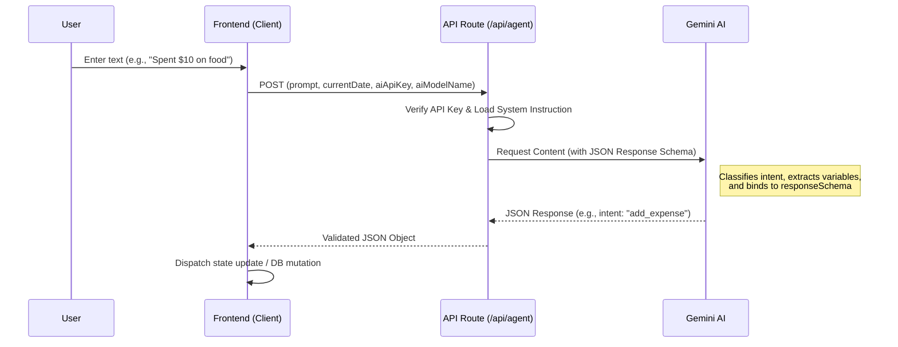

# AI Agent Working Document

## Overview

The AI Agent in this application serves as the core natural language understanding engine for interpreting user intents related to financial and habit tracking. Built around Google's Gemini models (e.g., `gemini-2.5-flash`), the agent dynamically processes user queries and outputs structured JSON data.

## Architecture & Data Flow

The following sequence diagram explains the typical data flow when a user submits a natural language request.

## How It Works

1. **User Input**: The user provides a natural language text prompt via the application interface.
2. **Context Enrichment**: The frontend bundles the prompt with the current date, the day of the week, and user-configured AI credentials. This context is critical for resolving relative dates like "tomorrow" or "yesterday".
3. **System Constraints**: The backend API endpoint (`/api/agent`) enforces a strict system instruction defining allowed intents (e.g., `add_expense`, `add_habit_plan`, `add_day_goal`) and enumerating required data types.
4. **Structured JSON Generation**: The Gemini Generative Model is constrained via the `responseSchema` parameter to ensure the output rigidly adheres to an expected JSON schema structure, preventing parsing errors.
5. **Execution**: The frontend translates the resultant structured JSON payload into application actions (e.g., mutating local state or executing a Supabase transaction).

---

## Estimated Cost Calculations

Assuming the underlying model is **Gemini 2.5 Flash** (the fallback application default if the user does not specify one) and accounting for typical system instruction lengths and JSON outputs.

**Average Assumptions per Request:**

- **Input Tokens**: ~600 tokens (System Instructions + Current Date Context + User Query)
- **Output Tokens**: ~150 tokens (Structured JSON Response)
- **Price per 1M Input Tokens**: ~$0.075
- **Price per 1M Output Tokens**: ~$0.30

### Cost Analysis (Per Average Request)

- Input Cost: `(600 / 1,000,000) * $0.075` = `$0.000045`
- Output Cost: `(150 / 1,000,000) * $0.30` = `$0.000045`
- **Total Estimated Cost per Request**: `$0.00009`

### Daily and Monthly Usage Projections

#### Scenario 1: 1 Request / Day Average

- **Daily Cost**: `1 * $0.00009` = **$0.00009**
- **Yearly Cost**: **$0.0328**

#### Scenario 2: 3 Requests / Day Average

- **Daily Cost**: `3 * $0.00009` = **$0.00027**
- **Yearly Cost**: **$0.0985**

#### Scenario 3: Monthly Cost (if user averages 3 requests per day)

- **Total Requests per Month**: `3 requests/day * 30 days` = **90 requests/month**
- **Total Monthly Cost**: `90 * $0.00009` = **$0.0081 per user/month**

### Total Monthly Cost of AI (At Scale)

To understand the broader business cost, here is the expected **Total Monthly Cost of AI** based on different numbers of active users, assuming the average of **3 requests/day per user** ($0.0081/month per user):

- **100 Active Users:** ~$0.81 / month
- **1,000 Active Users:** ~$8.10 / month
- **10,000 Active Users:** ~$81.00 / month
- **100,000 Active Users:** ~$810.00 / month

> **Note:** These calculations demonstrate the extreme cost-effectiveness of using optimized reasoning models like Gemini Flash for structured utility tasks. The overall cost footprint remains negligible even at scale.
