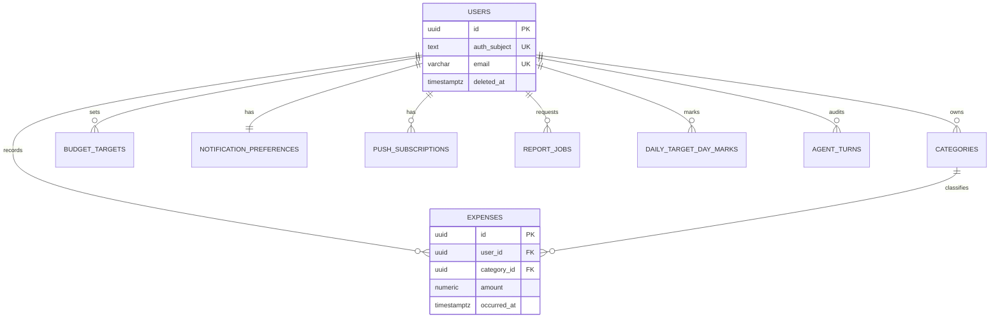

# Daily Expense Tracker — Database Design

**Document version:** 1.1  
**Last updated:** April 14, 2026  
**RDBMS:** PostgreSQL 15+  
**Related:** [Product documentation](./expense-tracker-documentation.md) · [System design](./system-design.md) · [API design](./api-design.md) · [Open questions](./open-questions.md)

---

## 1. Goals and principles

| Goal | Approach |
|------|----------|
| **Correctness** | `NUMERIC` for money; UUID primary keys; explicit foreign keys and checks |
| **Performance** | Indexes match list/filter and analytics queries; avoid over-indexing |
| **Evolvability** | Additive migrations first; enums via `CHECK` or `TEXT` + constraint for simpler changes |
| **Zero-cost operation (hobby / personal)** | Schema stays small; see §8 for free-tier services and sizing discipline |

This schema targets a **single-tenant-per-row** model (`user_id` on every user-owned table). There is no separate `tenants` table unless the product later adds organizations.

---

## 2. Entity catalog

| Table | Description | Lifecycle |
|-------|-------------|-----------|
| `users` | Application profile keyed to auth identity | created → active → optional soft-delete |
| `categories` | User-defined expense categories | created → updated → deleted if unused |
| `expenses` | Line-item spending | insert/update/delete |
| `budget_targets` | Daily / monthly / yearly limits | effective window per product rules |
| `notification_preferences` | One row per user (push/reminder/threshold) | upsert |
| `push_subscriptions` | Web Push endpoints per device/browser | insert/delete |
| `report_jobs` | Async Excel/PDF generation jobs | queued → processing → completed / failed |
| `daily_target_day_marks` | User checkbox: “met daily target” per calendar date | upsert |
| `agent_turns` (post-MVP) | Audit of agent tool calls (no raw audio) | append-only |

---

## 3. Money and time conventions

- **Money:** `NUMERIC(14, 4)` for `amount` fields. Never `FLOAT`/`REAL`. Four decimal places supports minor units and light FX if added later.
- **Timestamps:** `TIMESTAMPTZ` for all `*_at` fields; application stores UTC.
- **Dates:** `DATE` for budget effective bounds and report ranges where “calendar day” matters.
- **IDs:** `UUID` primary keys, `gen_random_uuid()` default (PostgreSQL 13+).

---

## 4. Table definitions

### 4.1 `users`

Stores profile data aligned with `GET /me`. Link to external auth (Clerk, Supabase Auth, Auth.js subject, etc.) via `auth_subject` or provider-specific column.

| Column | Type | Nullable | Default | Notes |
|--------|------|----------|---------|--------|
| `id` | UUID | NO | `gen_random_uuid()` | PK |
| `auth_subject` | TEXT | NO | — | **UNIQUE**; stable id from IdP (e.g. `sub` claim) |
| `email` | VARCHAR(320) | NO | — | UNIQUE (case-insensitive via functional index or `citext` if enabled) |
| `display_name` | VARCHAR(80) | YES | NULL | |
| `currency` | CHAR(3) | NO | `'USD'` | ISO 4217 |
| `timezone` | VARCHAR(64) | NO | `'UTC'` | IANA name |
| `created_at` | TIMESTAMPTZ | NO | `now()` | |
| `updated_at` | TIMESTAMPTZ | NO | `now()` | maintain via trigger or app |
| `deleted_at` | TIMESTAMPTZ | YES | NULL | soft-delete account |

**Indexes:**

- `PRIMARY KEY (id)`
- `UNIQUE (auth_subject)`
- `UNIQUE (email)` — or unique index on `lower(email)` if case-insensitive
- `INDEX users_deleted_at WHERE deleted_at IS NULL` (optional, for “active user” lookups)

---

### 4.2 `categories`

| Column | Type | Nullable | Default | Notes |
|--------|------|----------|---------|--------|
| `id` | UUID | NO | `gen_random_uuid()` | PK |
| `user_id` | UUID | NO | — | FK → `users(id)` |
| `name` | VARCHAR(64) | NO | — | |
| `color` | VARCHAR(32) | YES | NULL | hex or token |
| `icon_key` | VARCHAR(64) | YES | NULL | |
| `created_at` | TIMESTAMPTZ | NO | `now()` | |
| `updated_at` | TIMESTAMPTZ | NO | `now()` | |

**Constraints:**

- `FOREIGN KEY (user_id) REFERENCES users(id) ON DELETE CASCADE`
- `UNIQUE (user_id, name)` — prevent duplicate category names per user

**Indexes:**

- `INDEX categories_user_id`

---

### 4.3 `expenses`

| Column | Type | Nullable | Default | Notes |
|--------|------|----------|---------|--------|
| `id` | UUID | NO | `gen_random_uuid()` | PK |
| `user_id` | UUID | NO | — | FK → `users(id)` |
| `category_id` | UUID | NO | — | FK → `categories(id)` |
| `amount` | NUMERIC(14,4) | NO | — | must be positive |
| `note` | VARCHAR(500) | YES | NULL | |
| `occurred_at` | TIMESTAMPTZ | NO | — | when spend happened |
| `entry_type` | TEXT | NO | `'debit'` | `CHECK (entry_type IN ('debit','credit'))` — **debit** = outflow (spend), **credit** = inflow (refund/income) for calendar credited totals |
| `created_at` | TIMESTAMPTZ | NO | `now()` | |
| `updated_at` | TIMESTAMPTZ | NO | `now()` | |

**Constraints:**

- `FOREIGN KEY (user_id) REFERENCES users(id) ON DELETE CASCADE`
- `FOREIGN KEY (category_id) REFERENCES categories(id) ON DELETE RESTRICT` — force reassign or delete expenses first
- `CHECK (amount > 0)`

**Indexes (query-driven):**

- `INDEX expenses_user_occurred_at ON expenses (user_id, occurred_at DESC)` — list + date filters
- `INDEX expenses_user_category ON expenses (user_id, category_id)` — category breakdowns
- Partial index optional: `WHERE entry_type = 'debit'` if analytics queries filter often

**Optional (note search):**

- `INDEX expenses_note_trgm ON expenses USING gin (note gin_trgm_ops)` — requires `pg_trgm` extension; add only if search is required at scale.

---

### 4.4 `budget_targets`

| Column | Type | Nullable | Default | Notes |
|--------|------|----------|---------|--------|
| `id` | UUID | NO | `gen_random_uuid()` | PK |
| `user_id` | UUID | NO | — | FK → `users(id)` |
| `period` | TEXT | NO | — | `CHECK (period IN ('daily','monthly','yearly'))` |
| `amount` | NUMERIC(14,4) | NO | — | must be positive |
| `effective_from` | DATE | NO | — | |
| `effective_to` | DATE | YES | NULL | inclusive semantics defined in app |
| `created_at` | TIMESTAMPTZ | NO | `now()` | |
| `updated_at` | TIMESTAMPTZ | NO | `now()` | |

**Constraints:**

- `FOREIGN KEY (user_id) REFERENCES users(id) ON DELETE CASCADE`
- `CHECK (amount > 0)`
- **Uniqueness of “current” row per period** (choose one strategy):
  - **A)** Allow history: multiple rows per `(user_id, period)` with non-overlapping `[effective_from, effective_to]`, enforced in application; or
  - **B)** Single row per `(user_id, period)` with `UNIQUE (user_id, period)` if only one active target per period.

Product doc allows evolution; **recommended for v1:** `UNIQUE (user_id, period)` and updates overwrite the same row (simplest).

**Indexes:**

- `UNIQUE (user_id, period)` — if using strategy B
- `INDEX budget_targets_user_id`

---

### 4.5 `notification_preferences`

One row per user (upsert).

| Column | Type | Nullable | Default | Notes |
|--------|------|----------|---------|--------|
| `user_id` | UUID | NO | — | PK, FK → `users(id)` |
| `push_enabled` | BOOLEAN | NO | `false` | |
| `daily_reminder_enabled` | BOOLEAN | NO | `false` | |
| `daily_reminder_time` | TIME | YES | NULL | local interpretation with `timezone` on user |
| `threshold_percent` | SMALLINT | YES | NULL | 1–100 |
| `quiet_hours_start` | TIME | YES | NULL | |
| `quiet_hours_end` | TIME | YES | NULL | |
| `weekly_digest_enabled` | BOOLEAN | NO | `false` | |
| `weekly_digest_day` | TEXT | YES | NULL | `CHECK` weekday enum in app |
| `updated_at` | TIMESTAMPTZ | NO | `now()` | |

**Constraints:**

- `FOREIGN KEY (user_id) REFERENCES users(id) ON DELETE CASCADE`
- `PRIMARY KEY (user_id)`

---

### 4.6 `push_subscriptions`

| Column | Type | Nullable | Default | Notes |
|--------|------|----------|---------|--------|
| `id` | UUID | NO | `gen_random_uuid()` | PK |
| `user_id` | UUID | NO | — | FK → `users(id)` |
| `endpoint` | TEXT | NO | — | long URL |
| `p256dh` | TEXT | NO | — | from subscription keys |
| `auth` | TEXT | NO | — | from subscription keys |
| `created_at` | TIMESTAMPTZ | NO | `now()` | |

**Constraints:**

- `FOREIGN KEY (user_id) REFERENCES users(id) ON DELETE CASCADE`
- `UNIQUE (endpoint)` — endpoint identifies subscription globally

**Indexes:**

- `INDEX push_subscriptions_user_id`

---

### 4.7 `report_jobs`

| Column | Type | Nullable | Default | Notes |
|--------|------|----------|---------|--------|
| `id` | UUID | NO | `gen_random_uuid()` | PK |
| `user_id` | UUID | NO | — | FK → `users(id)` |
| `status` | TEXT | NO | `'queued'` | `CHECK` in (`queued`,`processing`,`completed`,`failed`) |
| `report_type` | TEXT | NO | — | e.g. `expense_detail`, `target_vs_actual` |
| `format` | TEXT | NO | — | `xlsx`, `pdf` |
| `date_from` | DATE | NO | — | |
| `date_to` | DATE | NO | — | |
| `options` | JSONB | NO | `'{}'` | include flags; keep small |
| `result_url` | TEXT | YES | NULL | signed URL or internal path |
| `result_expires_at` | TIMESTAMPTZ | YES | NULL | |
| `error_code` | TEXT | YES | NULL | |
| `error_message` | TEXT | YES | NULL | user-safe message only |
| `idempotency_key` | TEXT | YES | NULL | UNIQUE per user when present |
| `created_at` | TIMESTAMPTZ | NO | `now()` | |
| `updated_at` | TIMESTAMPTZ | NO | `now()` | |
| `completed_at` | TIMESTAMPTZ | YES | NULL | |

**Constraints:**

- `FOREIGN KEY (user_id) REFERENCES users(id) ON DELETE CASCADE`
- `CHECK (date_from <= date_to)`
- `UNIQUE (user_id, idempotency_key)` WHERE `idempotency_key IS NOT NULL`

**Indexes:**

- `INDEX report_jobs_user_status ON report_jobs (user_id, status, created_at DESC)`

**Retention:** periodic job deletes rows older than N days for completed/failed jobs to save space on free tiers.

---

### 4.8 `daily_target_day_marks`

Stores the **user checkbox** from the **Calendar day sheet** (“met daily target that day”). One row per `(user_id, calendar_date)` when the user has toggled or confirmed at least once; absence of a row means “unset / not checked.”

| Column | Type | Nullable | Default | Notes |
|--------|------|----------|---------|--------|
| `user_id` | UUID | NO | — | FK → `users(id)` |
| `calendar_date` | DATE | NO | — | **User-local calendar date** (interpret with `users.timezone` when bucketing `occurred_at`) |
| `target_completed` | BOOLEAN | NO | `false` | User intent: “I met my daily target” |
| `updated_at` | TIMESTAMPTZ | NO | `now()` | |

**Constraints:**

- `FOREIGN KEY (user_id) REFERENCES users(id) ON DELETE CASCADE`
- `PRIMARY KEY (user_id, calendar_date)`

**Indexes:**

- Covered by PK; optional `INDEX daily_marks_user_updated` if listing recent marks.

---

### 4.9 `agent_turns` (post-MVP)

| Column | Type | Nullable | Default | Notes |
|--------|------|----------|---------|--------|
| `id` | UUID | NO | `gen_random_uuid()` | PK |
| `user_id` | UUID | NO | — | FK → `users(id)` |
| `tool_name` | VARCHAR(64) | NO | — | e.g. `createExpense` |
| `args` | JSONB | NO | — | structured; no PII beyond what’s needed |
| `result_entity_id` | UUID | YES | NULL | e.g. expense id if created |
| `created_at` | TIMESTAMPTZ | NO | `now()` | |

**Constraints:**

- `FOREIGN KEY (user_id) REFERENCES users(id) ON DELETE CASCADE`

**Indexes:**

- `INDEX agent_turns_user_created ON agent_turns (user_id, created_at DESC)`

---

## 5. Relationship diagram (logical)

---

## 6. Query patterns and index coverage

| Query | Pattern | Index |
|-------|---------|--------|
| Expense list by user + date range | `WHERE user_id = ? AND occurred_at BETWEEN ? AND ? ORDER BY occurred_at DESC` | `(user_id, occurred_at DESC)` |
| Analytics by category for period | `WHERE user_id = ? AND occurred_at … GROUP BY category_id` | `(user_id, occurred_at)` + join to categories |
| Today’s spend | same with narrow date range | same |
| Active budget target | `WHERE user_id = ? AND period = ?` | `UNIQUE (user_id, period)` or `(user_id, period)` |
| Report job polling | `WHERE user_id = ? AND id = ?` | PK lookup |
| Push subs for user | `WHERE user_id = ?` | `push_subscriptions(user_id)` |
| Calendar month rollups | aggregate `expenses` by **local** date + `entry_type`; join `daily_target_day_marks` for checkbox | `(user_id, occurred_at)` + app-side date bucketing; PK on marks |
| Day detail | `WHERE user_id = ? AND occurred_at` in day window | same |

Run `EXPLAIN (ANALYZE, BUFFERS)` on production-like data before adding extra indexes.

---

## 7. Migration plan

1. **Baseline migration:** create `users`, `categories`, `expenses`, `budget_targets`, `notification_preferences`, `push_subscriptions`, `report_jobs`, `daily_target_day_marks` in dependency order.
2. **Extensions:** enable `pgcrypto` for `gen_random_uuid()` if not using PostgreSQL’s built-in default (depending on version).
3. **Additive:** add `expenses.entry_type` with default `debit` if table already existed without credits.
4. **Post-MVP:** add `agent_turns` in a separate migration.
5. **Production safety:** create indexes **CONCURRENTLY** where supported; add new columns as nullable first, then backfill, then constrain.
6. **Rollback:** each migration has a down migration or manual rollback steps for staging.

---

## 8. Zero-cost (free tier) hosting and sizing

The product goal is **no paid subscription** for individuals building and running a personal or small open-source deployment. Managed services change terms often—**confirm limits on each provider’s pricing page** before relying on them.

### 8.1 Recommended $0 stacks (typical patterns)

| Layer | Free-tier option | Why it fits this schema |
|-------|------------------|-------------------------|
| **PostgreSQL** | [Neon](https://neon.tech) (serverless), [Supabase](https://supabase.com) (DB + auth optional), [Aiven](https://aiven.io), self-hosted Postgres in Docker | Single database; small footprint if you prune old `report_jobs` and avoid huge JSONB |
| **Redis (optional)** | [Upstash](https://upstash.com) free tier | BullMQ / rate limits; optional if you use DB-backed queues for minimal MVP |
| **App hosting** | [Vercel](https://vercel.com) / [Cloudflare Workers](https://workers.cloudflare.com) / [Render](https://render.com) free tiers | API + static PWA |
| **Object storage for report files** | [Cloudflare R2](https://www.cloudflare.com/developer-platform/r2/) free allowance, or generate reports **on the fly** and stream without persisting | Keeps DB small; `result_url` short-lived |
| **Auth** | Supabase Auth free projects, [Clerk](https://clerk.com) dev/free tiers, or **Auth.js** with credentials + your own DB | `auth_subject` maps cleanly |

### 8.2 Staying within free limits

- **Storage:** hundreds of MB of Postgres is enough for many years of expenses for one user if rows stay narrow; avoid storing blobs in Postgres.
- **Report jobs:** delete completed jobs after 7–30 days or store only metadata + regenerate on repeat request.
- **Connections:** use a pooler (Neon/Supabase often provide; add **PgBouncer** if self-hosting).
- **Cold starts:** serverless DBs may sleep; first request after idle can be slower—acceptable for a hobby app.

### 8.3 Truly $0 self-hosted alternative

Run **PostgreSQL** and the API in **Docker Compose** on a home machine or a free VM trial—**$0** recurring cost, but you manage backups and uptime yourself.

---

## 9. Anti-patterns avoided

| Avoid | Use instead |
|-------|-------------|
| `FLOAT` for money | `NUMERIC(14,4)` |
| Sequential integer PKs for public ids | UUID |
| Storing PDF/XLSX bytes in `BYTEA` for every job | Object storage or ephemeral stream + short `result_url` TTL |
| Cascading delete from `categories` to expenses without intent | `ON DELETE RESTRICT` on `expenses.category_id` |

---

## 10. Quality checklist (schema review)

- [ ] All monetary columns use `NUMERIC`, not floating point  
- [ ] All user-owned rows include `user_id` and FK to `users`  
- [ ] Foreign keys defined with explicit `ON DELETE` behavior  
- [ ] List/filter indexes cover `expenses (user_id, occurred_at)`  
- [ ] Uniqueness rules for categories and budget targets match product rules  
- [ ] Migrations are additive for rolling deploys  
- [ ] Free-tier storage strategy documented (prune jobs, no large blobs in DB)  

---

## 11. Document map

| Section | Content |
|---------|---------|
| §1–3 | Goals, entities, conventions |
| §4–5 | Tables and ER diagram |
| §6–7 | Queries and migrations |
| §8 | **Zero-cost services** and sizing |
| §9–10 | Anti-patterns and checklist |
