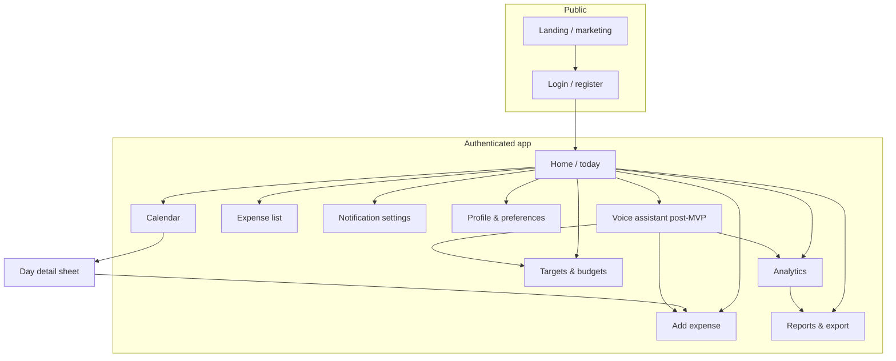
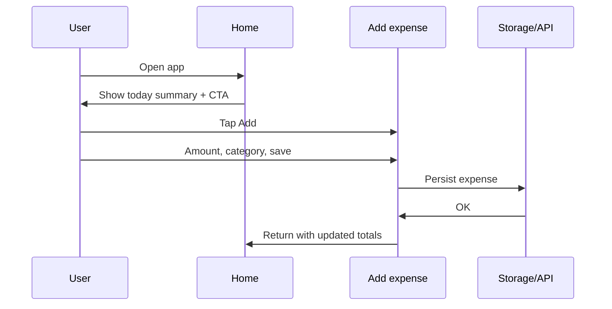
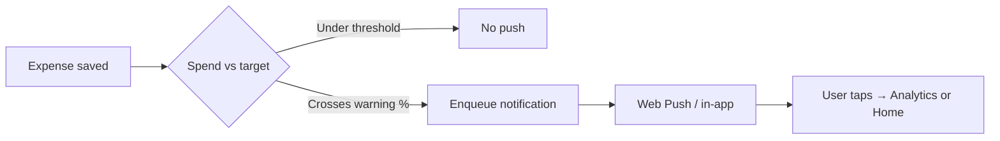
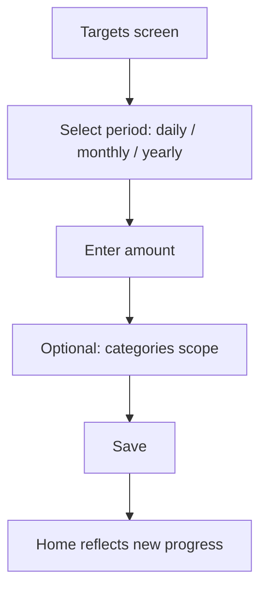
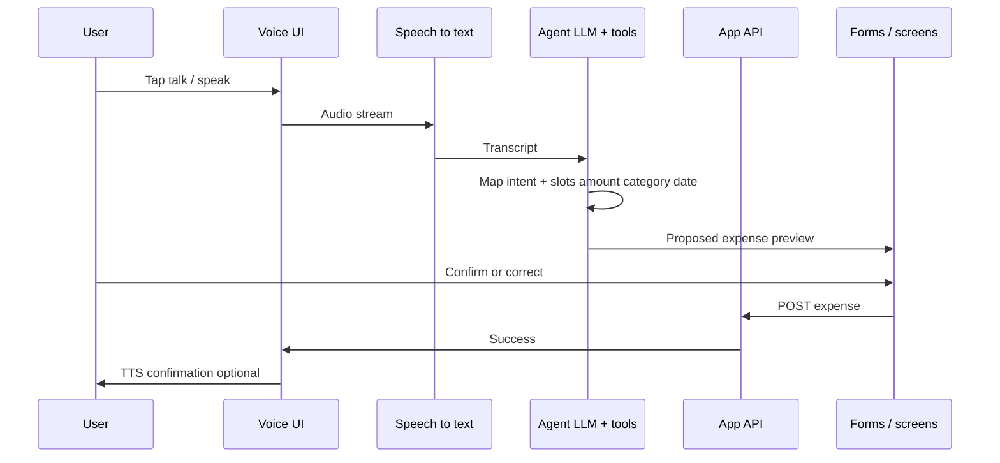
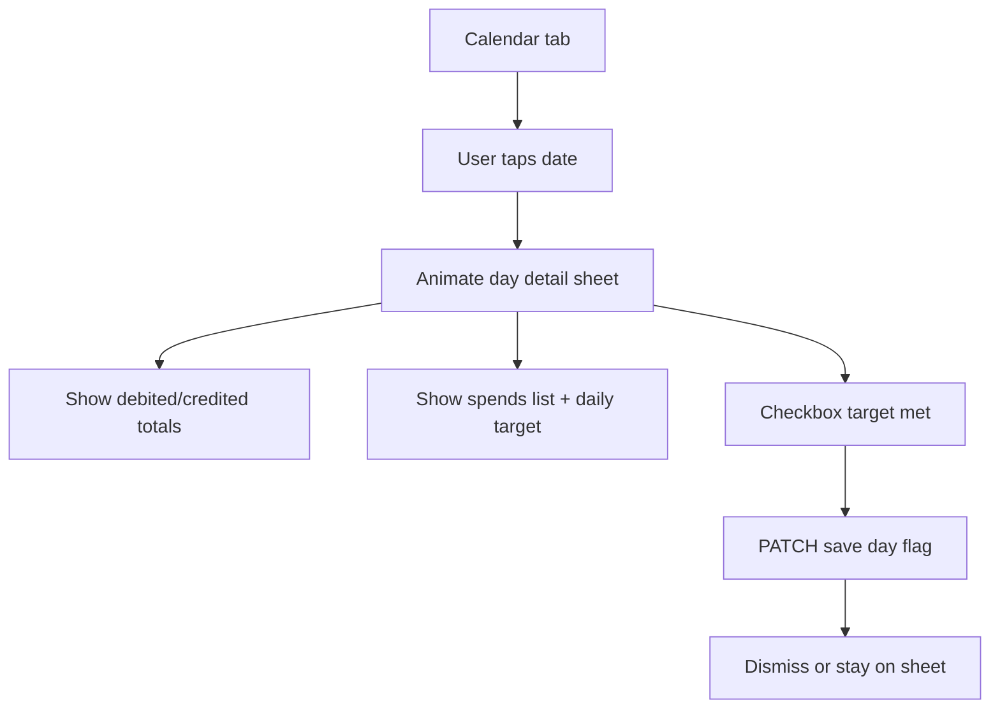
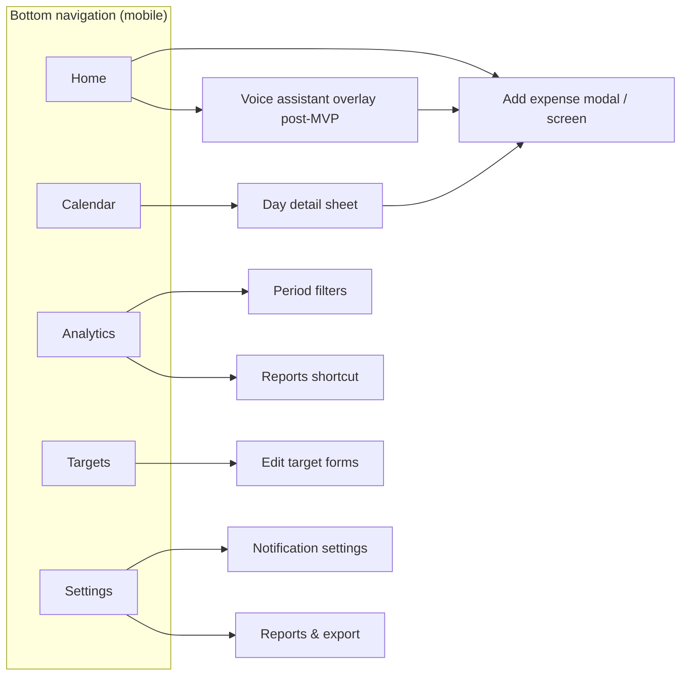

# Daily Expense Tracker — Project Documentation

**Version:** 1.5  
**Last updated:** April 14, 2026  
**Product type:** Web application, mobile-first  
**Primary focus:** Daily expense logging with targets, analytics, and notifications.

---

## 1. Product vision

A lightweight, mobile-first web app that helps people record spending quickly, stay within **daily / monthly / yearly** budgets, see **analytics** at a glance, and receive **timely notifications** so habits stay visible without opening the app constantly.

**Success looks like:**

- Users can log an expense in under 10 seconds on a phone.
- Users understand spend vs budget for the current period without drilling deep.
- Notifications support reminders and threshold alerts without feeling noisy.
- Users can **download structured reports** (Excel or PDF) that include **tabular records** and **visual charts** for expenses and daily (and other period) targets.
- Users can open a **Calendar** tab, tap any day, and see a **smooth bottom sheet / modal** with that day’s money in/out, spend breakdown, **daily target**, and a **checkbox** to record whether they met the target that day.

**Post-MVP (roadmap):** a **voice-enabled conversational agent** that talks with the user and **auto-fills** the right fields (expenses, targets, queries) with confirmation—see §3.8.

---

## 2. Target users

| Segment                           | Needs                                                              |
| --------------------------------- | ------------------------------------------------------------------ |
| Individuals                       | Simple daily tracking, budget discipline, occasional insights      |
| Students / young professionals    | Low friction, clear monthly caps, habit reminders                  |
| Small households (optional later) | Shared categories or export (out of scope for v1 unless specified) |

---

## 3. Core features

### 3.1 Daily expense tracking

- Add expense: amount, category, optional note, date (defaults to today).
- Edit / delete entries.
- Quick actions: repeat last expense, favorite categories.
- Currency display consistent with user locale.

### 3.2 Budget targets (daily, monthly, yearly)

- Set **target limit** per period (or per category, if product expands).
- Show **remaining budget** and **burn rate** (e.g. “~X/day to stay on track”).
- Visual indicators: safe / warning / over limit.

### 3.3 Analytics

- **Overview:** spend by category, trends over time.
- **Period compare:** this week vs last week, this month vs last month.
- **Insights (lightweight):** top category, streak of days logged, projected month-end spend.

### 3.4 Calendar view & day detail

- **Calendar tab:** A dedicated **Calendar** area shows the **current month** in a familiar grid (weekday headers, day cells). Days can show light **visual cues** (e.g. total spent intensity or a dot when there is activity) without cluttering small screens.
- **Tap a day:** A **smooth** overlay opens—prefer a **bottom sheet** (mobile) or **modal** with transition/animation—so the user stays oriented.
- **Day summary content (minimum):**
  - **Debited total** — sum of **outflows** (typical expenses) for that calendar day in the user’s currency.
  - **Credited total** — sum of **inflows** for that day (e.g. refunds, salary, or other income lines). If the product does not yet support income/refund line items, show **credits as zero** or hide the row until that capability exists (see [open-questions.md](./open-questions.md) if split).
  - **Spend detail** — list or grouped breakdown of **spends** that day (category, amount, note); link to edit an expense if needed.
  - **Daily target** — the **daily budget target** applicable to that date (from Targets settings), plus **spent vs target** (e.g. remaining or percent).
  - **Target completion checkbox** — **“I met my daily target today”** (wording adjustable). This is a **user-controlled flag** stored per user per calendar date; it does not replace automatic spend math but lets users **track intention or habit** (e.g. they stayed under budget even if the UI shows a warning). Synced via API so it survives devices.
- **Accessibility:** calendar grid navigable by keyboard where applicable; sheet focus trap and dismiss control.

### 3.5 Notifications

| Type             | Purpose                                              |
| ---------------- | ---------------------------------------------------- |
| Reminder         | Daily prompt to log expenses (user-chosen time)      |
| Threshold        | Approaching or exceeding daily/monthly/yearly target |
| Streak / summary | Optional weekly digest                               |

**Platform note:** On the web, notifications typically use **Web Push** (with user permission) or **in-app** notification center for browsers that block push. Document as a requirement: graceful fallback when permission denied.

### 3.6 Supporting features (recommended baseline)

- Authentication (email / OAuth) if data is cloud-synced.
- Categories: predefined + custom.
- Search / filter expenses by date range and category.
- Lightweight **CSV export** for raw backup (optional; complements full reports below).

### 3.7 Reports & download (Excel and PDF)

Users can generate and **download reports** in **Microsoft Excel** (`.xlsx`) or **PDF** (`.pdf`). Each report is suitable for archiving, sharing with an accountant, or offline review.

| Report type                | Contents (minimum)                                                                                                                                                                                                                                              |
| -------------------------- | --------------------------------------------------------------------------------------------------------------------------------------------------------------------------------------------------------------------------------------------------------------- |
| **Expense report**         | **Tables:** line-item expenses (date, category, amount, note) for a user-selected range; optional subtotals by category and by day/week. **Visuals:** at least one chart (e.g. category pie or donut, or spend-over-time line/bar) matching the selected range. |
| **Target / budget report** | **Tables:** daily (and/or monthly/yearly) **targets** vs **actual spend** per period row; variance column; optional list of days over daily target. **Visuals:** e.g. progress bars or a combo chart of target vs actual over time.                             |

**Shared behavior:**

- **Scope:** User picks date range and, where relevant, which target types to include (daily, monthly, yearly).
- **Format choice:** Same data can be exported as **Excel** (editable, multiple sheets acceptable: e.g. “Transactions”, “Summary”, “Charts” as embedded chart objects where supported) or **PDF** (fixed layout, print-friendly, charts rendered as vector or high-resolution images).
- **Branding / metadata:** Optional header with app name, user display name, generation date, and currency.
- **Performance:** Large ranges may show a progress state or async generation with download link when ready.

**Implementation note:** Excel charts may use native spreadsheet charts (server- or client-generated); PDF charts often use server-side rendering (e.g. headless browser or a PDF library) or pre-rendered chart images embedded in the document—document the chosen approach in technical design.

### 3.8 Post-MVP: Voice assistant & conversational agent

After core product maturity, add an **in-app agent** that users can **talk to** (voice in, voice out) so logging and common actions need fewer taps. The agent **interprets natural language**, holds a short dialog if something is ambiguous, and **writes structured values into the app** (forms, API) instead of the user typing.

| Capability                   | Behavior                                                                                                                                                                        |
| ---------------------------- | ------------------------------------------------------------------------------------------------------------------------------------------------------------------------------- |
| **Add expense**              | User says e.g. “Coffee four fifty at Starbucks”—agent extracts amount, payee/category hint, proposes values on the **Add expense** form or submits after explicit “yes / save.” |
| **Query**                    | “How much did I spend on food this week?”—agent reads totals from analytics APIs and answers verbally (and optionally scrolls/highlights UI).                                   |
| **Targets**                  | “Set my daily budget to eighty dollars”—agent fills **Targets** fields and asks for confirmation before persisting.                                                             |
| **Reports (optional later)** | “Email me last month’s PDF”—agent triggers report generation if product supports delivery beyond download.                                                                      |

**UX principles:**

- **Confirm before irreversible writes:** show a **preview card** of parsed fields (amount, category, date); user taps **Confirm** or corrects by voice/text.
- **Push-to-talk or tap-to-start** by default; optional “hands-free” only where platform policy allows.
- **Transparency:** visible transcript; easy to **undo** last agent action.
- **Privacy:** voice audio handled per policy (on-device vs cloud STT); no retention of raw audio beyond what is disclosed.

**Technical direction (high level):** combine **speech-to-text (STT)**, a **language model with tool/function calling** mapped to your REST or tRPC API, and **text-to-speech (TTS)** for replies. See §12 for stack options.

---

## 4. Non-functional requirements

| Area                   | Requirement                                                                                                         |
| ---------------------- | ------------------------------------------------------------------------------------------------------------------- |
| Layout                 | Mobile-first; touch targets ≥ 44px; readable typography on small screens                                            |
| Performance            | First interactive screen fast on 3G; list virtualization for long history                                           |
| Accessibility          | Semantic structure, labels for forms, sufficient contrast; calendar grid and day sheet keyboard-accessible          |
| Privacy                | Clear data policy; local-only option if offline-first is chosen                                                     |
| Notifications          | Explicit opt-in; quiet hours; easy disable per notification type                                                    |
| Reports                | Generated files must match user-visible filters; filenames include date range; PDFs readable when printed grayscale |
| Voice agent (post-MVP) | User consent for mic; clear indicator when listening; graceful degradation to text-only if voice unavailable        |

---

## 5. Information architecture (lo-fi)



---

## 6. Primary user flows

### 6.1 Log expense (happy path)



### 6.2 Notification: threshold near limit



### 6.3 Set monthly target



### 6.4 Download expense or target report (Excel / PDF)

```mermaid
flowchart TD
  A[Reports & export] --> B[Choose report: Expense | Target / budget]
  B --> C[Set date range and options]
  C --> D[Preview summary optional]
  D --> E{Format}
  E -->|Excel| F[Generate .xlsx with tables + charts]
  E -->|PDF| G[Generate .pdf with tables + charts]
  F --> H[Browser download]
  G --> H
```

### 6.5 Voice agent: add expense via conversation (post-MVP)



### 6.6 Open a day on the calendar



---

## 7. Screen inventory (mobile-first)

| Screen                     | Purpose                                                                                  |
| -------------------------- | ---------------------------------------------------------------------------------------- |
| Splash / load              | Brand, session restore                                                                   |
| Login / register           | Access private data                                                                      |
| Home (today)               | Balance vs target, quick add, recent items                                               |
| Calendar                   | Month grid; navigate months; tap day opens sheet                                         |
| Day detail sheet           | Debited/credited totals, spends list, daily target, “target met” checkbox                |
| Add expense                | Form + category picker                                                                   |
| Expense list               | Scrollable history, filters                                                              |
| Expense detail             | Edit/delete single item                                                                  |
| Targets                    | CRUD for daily/monthly/yearly limits                                                     |
| Analytics                  | Charts, breakdowns, comparisons                                                          |
| Reports & export           | Date range, report type, Excel vs PDF, optional preview before download                  |
| Notifications              | Toggle types, time, quiet hours                                                          |
| Profile                    | Currency, locale, logout, account                                                        |
| Voice assistant (post-MVP) | Mic control, transcript, agent reply, preview card before save; links into Add / Targets |

---

## 8. Low-fidelity wireframes (ASCII)

### 8.1 Home — today

```
┌─────────────────────────────┐
│  ≡  Expenses        🔔  ⋮   │  ← header
├─────────────────────────────┤
│  Tuesday, Apr 14            │
│  ─────────────────────────  │
│  Spent today                │
│  $42.50  /  $80.00          │  ← progress to daily target
│  ████████░░░░░░  53%        │
│                             │
│  [  + Add expense          ]│  ← primary CTA
│                             │
│  Recent                     │
│  ┌─────────────────────┐    │
│  │ Coffee      $4.50   │    │
│  │ Transport  $12.00   │    │
│  │ Lunch       $18.00  │    │
│  └─────────────────────┘    │
│                             │
│  ─────────────────────────  │
│  🏠   📅   📊   🎯   ⚙️      │  ← nav: home, calendar, analytics, targets, settings
└─────────────────────────────┘
```

### 8.2 Calendar — month

```
┌─────────────────────────────┐
│  ←  April 2026        ›     │  ← month switcher
├─────────────────────────────┤
│  Mo Tu We Th Fr Sa Su       │
│           1  2  3  4  5      │
│   6  7  8  9 10 11 12       │  ← subtle fill or dot = activity
│  13 14 15 16 17 18 19       │
│  20 21 22 23 24 25 26       │
│  27 28 29 30                │
│                             │
│  ─────────────────────────  │
│  🏠   📅   📊   🎯   ⚙️      │
└─────────────────────────────┘
```

### 8.3 Day detail — bottom sheet (after tap)

```
        ┌─────────────────────────────┐
        │  ───  drag handle           │
        │  Tuesday, April 14, 2026    │
        │  ─────────────────────────  │
        │  Debited (spent)   $42.50   │
        │  Credited (in)      $0.00   │  ← or hidden if no credits
        │  ─────────────────────────  │
        │  Daily target       $80.00  │
        │  Remaining          $37.50  │
        │  ████████░░░░░░  53%        │
        │  ─────────────────────────  │
        │  Spends                     │
        │  Food        $18.00         │
        │  Transport   $12.00         │
        │  Coffee       $4.50         │
        │  [ + Add expense for day ]  │
        │  ─────────────────────────  │
        │  [✓] I met my daily target  │  ← persisted checkbox
        │                             │
        │  [        Close        ]    │
        └─────────────────────────────┘
```

### 8.4 Add expense

```
┌─────────────────────────────┐
│  ←  Add expense             │
├─────────────────────────────┤
│  Amount                     │
│  ┌─────────────────────┐    │
│  │  $  0.00            │    │  ← large numeric input
│  └─────────────────────┘    │
│                             │
│  Category                   │
│  [ Food ▼ ]                 │
│                             │
│  Note (optional)            │
│  ┌─────────────────────┐    │
│  │                     │    │
│  └─────────────────────┘    │
│                             │
│  Date  [ Today      📅 ]    │
│                             │
│  [      Save expense       ]│
└─────────────────────────────┘
```

### 8.5 Analytics (overview)

```
┌─────────────────────────────┐
│  ←  Analytics               │
├─────────────────────────────┤
│  [ Day │ Week │ Month │ Year]│  ← period tabs
│                             │
│  Total this month           │
│  $1,240                     │
│  ▲ 8% vs last month         │
│                             │
│  ┌─────────────────────┐    │
│  │     (chart area)    │    │  ← line or bar placeholder
│  │  ~~~ ~~~ ~~~        │    │
│  └─────────────────────┘    │
│                             │
│  By category                │
│  Food        ██████  42%    │
│  Transport   ████    28%    │
│  Other       ██      15%    │
└─────────────────────────────┘
```

### 8.6 Targets & budgets

```
┌─────────────────────────────┐
│  ←  Targets                 │
├─────────────────────────────┤
│  Daily limit                │
│  $80.00          [ Edit ]   │
│  ████████░░  $37.50 left    │
│                             │
│  Monthly limit              │
│  $2,000.00       [ Edit ]   │
│  ██████░░░░  $560 left      │
│                             │
│  Yearly limit               │
│  $24,000.00      [ Edit ]   │
│  ██████████  on track       │
│                             │
│  [ + Add custom rule ]      │  ← optional future
└─────────────────────────────┘
```

### 8.7 Notification settings

```
┌─────────────────────────────┐
│  ←  Notifications           │
├─────────────────────────────┤
│  Browser push               │
│  [  ●──────  ]  Enabled     │
│                             │
│  Daily reminder             │
│  [  ●──────  ]  8:00 PM     │
│                             │
│  Alert when near limit      │
│  [  ●──────  ]  at 80%      │
│                             │
│  Quiet hours                │
│  [ 10:00 PM ] – [ 7:00 AM ] │
│                             │
│  Weekly summary             │
│  [  ○──────  ]  Off         │
└─────────────────────────────┘
```

### 8.8 Reports & export

```
┌─────────────────────────────┐
│  ←  Reports & export        │
├─────────────────────────────┤
│  Report type                │
│  ( ) Expense detail         │
│  (•) Target vs actual       │  ← daily / monthly / yearly sections in PDF/Excel
│                             │
│  Date range                 │
│  [ Apr 1, 2026 ] – [ … ] 📅 │
│                             │
│  Include                    │
│  [✓] Transaction table      │
│  [✓] Category chart         │
│  [✓] Target comparison      │
│                             │
│  Format                     │
│  [ Excel (.xlsx)  ▼ ]       │
│     or PDF (.pdf)           │
│                             │
│  [     Preview summary     ]│  ← optional
│  [   Download report       ]│
└─────────────────────────────┘
```

### 8.9 Voice assistant (post-MVP) — overlay

```
┌─────────────────────────────┐
│  Home (dimmed)          ✕   │
│  ╔═══════════════════════╗  │
│  ║  🎤  Voice assistant  ║  │
│  ║  ───────────────────  ║  │
│  ║  You: "Coffee 4.50    ║  │  ← live transcript
│  ║       food today"     ║  │
│  ║  Agent: "Log $4.50    ║  │
│  ║   Food, today?"       ║  │
│  ║  ───────────────────  ║  │
│  ║  Preview               ║  │
│  ║  $4.50 · Food · Today ║  │
│  ║  [ Edit ] [ Confirm ]  ║  │  ← auto-filled; confirm writes to API
│  ║  ▁▂▃▅▂▁  listening…   ║  │  ← optional waveform
│  ╚═══════════════════════╝  │
│         [ Hold to talk ]     │  ← FAB when sheet closed
└─────────────────────────────┘
```

---

## 9. UI structure diagram (navigation model)



_(Post-MVP: floating “assistant” entry from Home opens overlay; confirmed actions route to same screens/API as manual entry.)_

---

## 10. Data model (conceptual)

**Entities (high level):**

- **User** — id, preferences (currency, timezone, notification flags).
- **Expense** — id, userId, amount, categoryId, note, occurredAt, createdAt; optional **entry direction** (`debit` | `credit`) when income/refunds are modeled—otherwise all rows are debits.
- **Category** — id, userId, name, icon/color.
- **BudgetTarget** — id, userId, period (`daily` | `monthly` | `yearly`), amount, optional category scope, effective dates.
- **Calendar day mark** — userId, **calendar date** (date-only), **targetCompleted** (boolean): user checkbox for “met daily target that day.” At most one row per user per date.

Relationships: User 1—_ Expense; User 1—_ Category; User 1—_ BudgetTarget; User 1—_ CalendarDayMark (by date).

**Post-MVP (optional):** **Agent audit log** — userId, timestamp, tool name (`createExpense`, …), structured args, resulting entity id; **no raw audio** unless user explicitly opts in for support.

---

## 11. Notification matrix (implementation checklist)

| Event          | Channel                       | User control         |
| -------------- | ----------------------------- | -------------------- |
| Daily reminder | Push / email fallback         | Time + on/off        |
| Near limit     | Push + optional in-app banner | Threshold % + on/off |
| Over limit     | Push                          | On/off               |
| Weekly digest  | Push / email                  | Day + on/off         |

**Edge cases:** Multiple targets (daily + monthly) can fire separate alerts; deduplicate or batch within a short window to avoid spam.

---

## 12. Recommended tech stack

The tables below describe one **coherent default** for a **TypeScript-first**, **mobile-first PWA** with a **synced backend**. Swap parts as needed (e.g. Firebase instead of custom API) if you optimize for speed over flexibility.

### 12.1 Client (web application)

| Area            | Suggested choice                                                      | Notes                                                                                       |
| --------------- | --------------------------------------------------------------------- | ------------------------------------------------------------------------------------------- |
| Language        | **TypeScript**                                                        | Shared types/schemas with API                                                               |
| App shell       | **React 18+** with **Vite** (SPA) **or** **Next.js** 14+ (App Router) | Next.js: built-in API routes, SSR/ISR; Vite: fast dev, pair with separate Node API          |
| Styling         | **Tailwind CSS**                                                      | Mobile-first breakpoints; optional **Radix UI** / **Headless UI** for accessible primitives |
| Server state    | **TanStack Query**                                                    | Caching, retries, background refresh for API data                                           |
| Client state    | **Zustand** or minimal **React context**                              | Prefer TanStack Query for server data; local UI only in Zustand                             |
| Forms           | **React Hook Form** + **Zod**                                         | Same Zod schemas as API validation when possible                                            |
| Charts          | **Recharts** or **Visx**                                              | Respect `prefers-reduced-motion`; accessible labels                                         |
| Calendar UI     | **React Day Picker**, **FullCalendar** (subset), or headless grid     | Month view + a11y; match user timezone                                                      |
| PWA             | **vite-plugin-pwa** or **@ducanh2912/next-pwa**                       | Manifest, service worker, offline shell (optional offline data later)                       |
| i18n / currency | **FormatJS** / **i18next**                                            | Align with user locale for money and dates                                                  |

### 12.2 API & backend services

| Area                 | Suggested choice                                              | Notes                                                                     |
| -------------------- | ------------------------------------------------------------- | ------------------------------------------------------------------------- |
| Runtime              | **Node.js 20 LTS**                                            | Broad library support for PDF/XLSX jobs                                   |
| HTTP API             | **NestJS** **or** **Hono** / **Express** + **Zod** validation | REST + OpenAPI **or** **tRPC** if monorepo end-to-end TS                  |
| Background jobs      | **BullMQ** + **Redis**                                        | Scheduled reminders, digest emails, **async PDF/Excel** for large reports |
| Real-time (optional) | **WebSocket** or **SSE**                                      | Progress for long exports; **post-MVP** streaming agent tokens            |

### 12.3 Data & storage

| Area                 | Suggested choice                  | Notes                                                      |
| -------------------- | --------------------------------- | ---------------------------------------------------------- |
| Primary DB           | **PostgreSQL** 15+                | Relational model fits users, expenses, categories, targets |
| ORM                  | **Prisma** **or** **Drizzle**     | Migrations; type-safe queries                              |
| Cache / queue broker | **Redis**                         | BullMQ, rate limiting, session cache                       |
| Files (optional)     | **S3-compatible** (R2, S3, MinIO) | Temporary report blobs if not streamed directly            |

### 12.4 Authentication & security

| Area          | Suggested choice                                                        | Notes                                        |
| ------------- | ----------------------------------------------------------------------- | -------------------------------------------- |
| Auth platform | **Clerk**, **Auth.js** (NextAuth), **Supabase Auth**, or **Auth0**      | OAuth + email; session or JWT                |
| API security  | HTTPS only; **CORS** locked to app origin; **CSRF** for cookie sessions | Rate limiting on auth and agent endpoints    |
| Secrets       | **Vault** / cloud secret manager                                        | No keys in client for LLM if server-mediated |

### 12.5 Notifications (web push)

| Area     | Suggested choice                                   | Notes                                             |
| -------- | -------------------------------------------------- | ------------------------------------------------- |
| Protocol | **Web Push** (VAPID)                               | Service worker subscription stored per user in DB |
| Delivery | Backend sends via **web-push** library or provider | Fallback: in-app feed if permission denied        |

### 12.6 Reports (Excel & PDF)

| Area  | Suggested choice                                                              | Notes                                                                   |
| ----- | ----------------------------------------------------------------------------- | ----------------------------------------------------------------------- |
| Excel | **ExcelJS** or **SheetJS** (tradeoffs for chart embedding)                    | Multi-sheet: Transactions, Summary; embed charts where library supports |
| PDF   | **Playwright** / **Puppeteer** (HTML → PDF) **or** **pdf-lib** + chart raster | Charts as SVG/PNG embedded for consistent print                         |

### 12.7 Hosting & operations

| Area             | Suggested choice                                            | Notes                                   |
| ---------------- | ----------------------------------------------------------- | --------------------------------------- |
| Frontend         | **Vercel**, **Netlify**, **Cloudflare Pages**               | Edge CDN, easy previews                 |
| API + workers    | **Railway**, **Fly.io**, **Render**, or **AWS ECS/Fargate** | Long-running job workers for queues     |
| Managed Postgres | **Neon**, **Supabase**, **Railway**, **RDS**                | Backups, connection pooling (PgBouncer) |
| Observability    | **Sentry**, **OpenTelemetry**                               | Errors + latency on API and agent calls |

### 12.8 Post-MVP: voice agent & automation

Keep **the same domain API** the UI uses; the agent calls it via **tool/function** definitions so values stay consistent and auditable.

| Layer                          | Suggested choice                                                                                            | Notes                                                                 |
| ------------------------------ | ----------------------------------------------------------------------------------------------------------- | --------------------------------------------------------------------- |
| Speech-to-text                 | **OpenAI Whisper API**, **Google Cloud Speech-to-Text**, **Deepgram**, or **browser Web Speech API**        | Web API alone is uneven across browsers—plan cloud STT for production |
| Reasoning + structured actions | **OpenAI** (GPT-4.x / **Responses** with tools), **Google Gemini** (tools), or **Anthropic Claude** (tools) | Map tools: `createExpense`, `updateTarget`, `getSummary`, etc.        |
| Text-to-speech                 | **OpenAI TTS**, **Google Cloud TTS**, **Amazon Polly**, or **ElevenLabs**                                   | Optional; **speechSynthesis** for low-friction MVP of voice UX        |
| Unified voice (optional)       | **OpenAI Realtime API** (or similar)                                                                        | Single session for speech in/out; still validate tools server-side    |
| Client UX                      | Push-to-talk button, waveform, **live transcript**, **preview card** before commit                          | Mic permission; show “listening” state clearly                        |

**Integration pattern:** Browser sends audio or text to **your backend**; backend calls STT/LLM with **user-scoped** tools that hit PostgreSQL via the same service layer as REST. **Never** expose raw provider API keys in the client.

### 12.9 Monorepo & shared contracts (optional)

| Area           | Suggested choice        | Notes                                                                                                              |
| -------------- | ----------------------- | ------------------------------------------------------------------------------------------------------------------ |
| Monorepo       | **Turborepo** or **Nx** | Single repo for `web` + `api` + shared packages                                                                    |
| Shared package | **`packages/shared`**   | Zod schemas, DTO types, OpenAPI client (generated or **tRPC** router); keeps agent tools and REST handlers aligned |

---

## 13. Milestones (example)

| Phase    | Deliverables                                                                                                                                                                                       |
| -------- | -------------------------------------------------------------------------------------------------------------------------------------------------------------------------------------------------- |
| MVP      | Auth, add/list expenses, categories, monthly target, basic analytics                                                                                                                               |
| v1.1     | Daily/yearly targets, push notifications, quiet hours, **Calendar tab** with month grid, **day detail sheet** (debited/credited totals, spends, daily target, **target-met checkbox**)             |
| v1.2     | Period compare, CSV backup, improved insights                                                                                                                                                      |
| v1.3     | **Reports:** download **Excel** and **PDF** with **transaction tables**, **target vs actual tables**, and **embedded charts** (expense + target reports per §3.7)                                  |
| Post-MVP | **Voice assistant / conversational agent:** STT + LLM with tools + TTS (or Realtime API); **auto-fill** expenses, targets, and **query** analytics with **confirmation** before save (§3.8, §12.8) |

---

## 14. Open decisions

Unresolved questions and decision candidates are maintained in **[open-questions.md](./open-questions.md)** (with IDs, status, and a resolved log) so answers do not drift across documents.

---

## Document map

| Section | Content                                                                                          |
| ------- | ------------------------------------------------------------------------------------------------ |
| §1–4    | Vision, users, features (incl. Calendar §3.4, Excel/PDF §3.7, voice §3.8), NFRs                  |
| §5–7    | IA, flows (incl. calendar day sheet, report download, voice post-MVP), screens                   |
| §8      | ASCII wireframes (incl. Calendar, day sheet, Reports, Voice)                                     |
| §9–11   | Nav diagram, data model sketch, notifications                                                    |
| §12–14  | **Recommended tech stack** (§12), roadmap; open items → [open-questions.md](./open-questions.md) |
| §15     | Google Stitch UI generation prompts                                                              |
| —       | [db-design.md](./db-design.md) — physical schema, indexes, migrations, **free-tier** DB hosting  |
| —       | [open-questions.md](./open-questions.md) — **open items & decision log**                         |

**Architecture & API:** see [system-design.md](./system-design.md) (components, data flows, scaling), [api-design.md](./api-design.md) (REST `v1` contracts, errors, pagination), [db-design.md](./db-design.md) (PostgreSQL schema, indexes, free-tier sizing), and [open-questions.md](./open-questions.md) (tracked decisions and open items).

This document is suitable for sharing with designers and engineers as a single source of truth for scope and UX structure before high-fidelity UI work.

---

## 15. Google Stitch — UI generation prompts

Use these prompts in [Google Stitch](https://stitch.withgoogle.com/) (Google Labs). Stitch accepts plain-language descriptions; start with the **master prompt** for a coherent design system, then refine with **follow-up prompts** one screen or change at a time for best results.

### How to use

1. Paste the **master prompt** into a new Stitch project to generate the core mobile layouts and shared components (navigation, typography, color).
2. Iterate with **follow-up prompts** to adjust spacing, dark mode, accessibility, or add states (empty list, over-budget warning).
3. Optional: upload the ASCII wireframes from §8 as reference images if Stitch experimental sketch-to-UI mode is available.

---

### Master prompt (copy as one block)

```
Design a mobile-first web application UI for a personal daily expense tracker. Target users are busy individuals who need to log spending in under 10 seconds and see budget progress at a glance.

Product goals:
- Primary actions: add an expense (amount, category, optional note, date defaulting to today), view today’s spend vs daily budget, browse recent transactions.
- **Calendar:** a **Calendar** tab with a **month grid**; tapping a day opens a **smooth bottom sheet** showing **debited total (spent)**, **credited total (inflows)** (or $0 if none), **list of spends** that day, the **daily target** with progress, and a **checkbox** “I met my daily target today” with clear persisted state.
- Secondary: analytics with period tabs (day / week / month / year), spending chart, category breakdown with simple bars or a donut chart.
- Budgets: one screen for daily, monthly, and yearly spending targets; each shows limit, amount spent, remaining, and a linear progress bar with clear “safe / warning / over budget” states (use color thoughtfully, not only red/green).
- Reports: a “Reports & export” flow to download **Excel** or **PDF** files that include **data tables** (transactions; target vs actual for daily/monthly/yearly) and **charts** (e.g. category split, spend over time)—show format picker, date range, checkboxes for what to include, and primary Download.
- Notifications: settings screen with toggles for browser push, daily reminder time picker, threshold alert (e.g. warn at 80% of limit), and quiet hours (start–end time).
- Post-MVP (optional separate frame): voice assistant overlay with transcript, suggested auto-filled expense or target preview, Confirm/Edit, hold-to-talk or tap-to-talk, subtle listening indicator.

Layout and UX:
- Single-column phone layout, max width ~430px centered on larger viewports; thumb-friendly bottom navigation with **five** items: **Home, Calendar, Analytics, Targets, Settings** (use clear icons + short labels).
- Sticky top app bar on inner screens with back affordance where needed; primary CTA on Home is a full-width “Add expense” button.
- Use Material Design 3-inspired components: filled buttons, segmented buttons or tabs for analytics periods, cards for recent expenses and budget rows.
- Typography: clear hierarchy—large numbers for money, smaller captions for labels. Generous vertical spacing; touch targets at least 44px.

Visual direction:
- Clean, calm, trustworthy fintech aesthetic—light background, one accent color (e.g. teal or indigo), neutral grays for secondary text. Optional: include a tasteful dark mode variant in the same system.
- Avoid clutter; empty states should include a short message and a single CTA.
- WCAG-minded contrast for text and chart elements.

Deliverable:
- High-fidelity screens for: (1) Home / Today with progress to daily target and recent list, (2) **Calendar month** + **day-detail bottom sheet** (totals, spend list, daily target, checkbox), (3) Add expense form, (4) Analytics overview, (5) Targets & budgets (daily/monthly/yearly), (6) Reports & export (Excel/PDF, date range, report type, include tables/charts), (7) Notification settings, (8) simple Login or email entry if needed for a web app. Show consistent header, bottom nav, and component styles across screens.
```

---

### Follow-up prompts (iterate after the master generation)

Use these one at a time to refine Stitch output.

| Goal                       | Prompt                                                                                                                                                                                                                                                                                              |
| -------------------------- | --------------------------------------------------------------------------------------------------------------------------------------------------------------------------------------------------------------------------------------------------------------------------------------------------- |
| Dark mode                  | `Apply the same design system in dark mode: elevated surfaces, readable chart colors on dark background, no pure black—use dark gray surfaces.`                                                                                                                                                     |
| Over-budget state          | `On the Home screen, show a variant where the user is over the daily budget: prominent warning banner, progress bar past 100%, still accessible Add expense button.`                                                                                                                                |
| Empty state                | `Home screen empty state: no expenses yet—illustration or icon, short copy, one primary button to add first expense.`                                                                                                                                                                               |
| Analytics detail           | `Analytics screen: add a “vs last period” comparison line under the total, and a horizontal bar chart for top 5 categories.`                                                                                                                                                                        |
| Accessibility              | `Increase default font sizes slightly, ensure all interactive elements have visible focus states, and chart patterns are not color-only (labels or icons).`                                                                                                                                         |
| Desktop                    | `Provide a responsive widening for tablet/desktop: keep bottom nav or move to a left sidebar; content max-width with more chart width.`                                                                                                                                                             |
| Reports screen             | `Design “Reports & export”: report type (expense detail vs target vs actual), date range pickers, toggles for including transaction table and charts, dropdown for Excel vs PDF, secondary Preview and primary Download button; show a small mock of what tables/charts represent (not real data).` |
| Voice assistant (post-MVP) | `Bottom sheet or modal “Voice assistant” over Home: user transcript and agent reply text, preview row for parsed expense ($, category, date), primary Confirm and secondary Edit, microphone affordance and optional audio waveform; calm fintech styling matching the rest of the app.`            |
| Calendar + day sheet       | `Calendar tab: clean month grid with weekday headers, prev/next month, subtle indicator on days with spending; tap opens animated bottom sheet with debited/credited rows, mini spend list, daily target progress, checkbox “I met my daily target,” drag handle, and Close.`                       |

---

### One-screen shortcut (if you prefer narrow scope first)

```
Mobile-first single screen only: “Home / Today” for a daily expense app. Show today’s date, spent amount vs daily budget with a progress bar, a full-width primary button “Add expense”, and a scrollable list of recent transactions (merchant or category, amount, time). Bottom navigation with Home, Calendar, Analytics, Targets, Settings. Clean Material 3 style, light theme, calm fintech look, 430px width.
```
