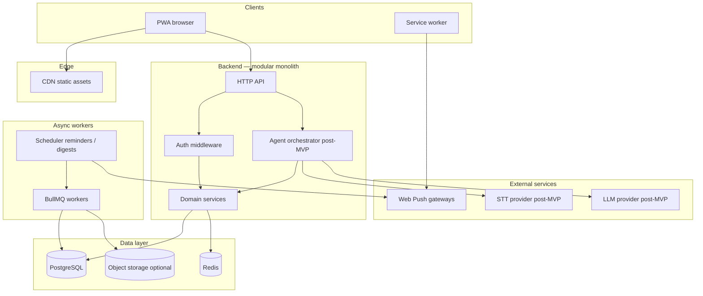
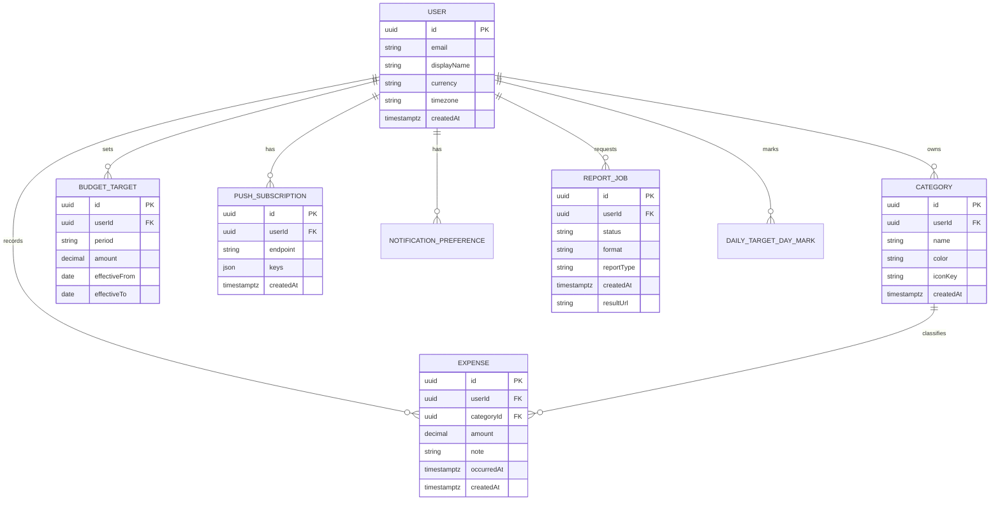

# Daily Expense Tracker — System Design

**Document version:** 1.0  
**Last updated:** April 14, 2026  
**Related:** [Product documentation](./expense-tracker-documentation.md) · [API design](./api-design.md) · [Database design](./db-design.md) · [Open questions](./open-questions.md)

---

## 1. Overview

This document describes the **architecture** for a **mobile-first web application** that tracks daily expenses, provides a **calendar** view with **per-day summaries** and optional **target-met** marks, enforces **daily / monthly / yearly** budget targets, surfaces **analytics**, delivers **web push notifications**, generates **Excel/PDF reports**, and (post-MVP) exposes a **voice assistant** that uses the same backend contracts as the UI.

**Design stance:** Start as a **modular monolith** (single deployable API + worker process) with clear domain boundaries so services can be split later if needed. Avoid premature microservices.

---

## 2. Requirements Summary

### 2.1 Functional (from product spec)

| Area          | Capability                                                              |
| ------------- | ----------------------------------------------------------------------- |
| Identity      | Register, login, session or token-based access                          |
| Expenses      | CRUD; filter by date range and category; pagination                     |
| Categories    | User-defined categories with optional icon/color                        |
| Targets       | CRUD for budget targets per period (`daily`, `monthly`, `yearly`)       |
| Analytics     | Aggregates by period; optional period-over-period compare               |
| Notifications | User preferences; web push subscription lifecycle                       |
| Reports       | Async generation of Excel/PDF with tables + charts; download            |
| CSV           | Optional lightweight raw export                                         |
| Post-MVP      | Voice agent uses domain APIs via tool layer; confirmation before writes |

### 2.2 Non-functional

| Area            | Target                                                            |
| --------------- | ----------------------------------------------------------------- |
| Availability    | 99.9% API monthly (single-region MVP acceptable)                  |
| Latency         | p95 below 300 ms for read/write CRUD under normal load            |
| Reports         | Async if generation exceeds ~2 s; progress or polling             |
| Security        | TLS everywhere; auth on all private routes; secrets not in client |
| Privacy         | User data scoped by `userId`; configurable data retention         |
| Scale (initial) | Thousands of active users; horizontal scale of stateless API      |

---

## 3. High-level architecture



**Flow summary:**

- **PWA** calls **REST API** (`/api/v1/...`) with bearer or session cookie.
- **Service worker** registers **push subscriptions** stored in PostgreSQL; **workers** send pushes via standard Web Push.
- **Report jobs** enqueue to **BullMQ**; worker renders Excel/PDF, stores blob in **object storage** or streams short-lived signed URL.
- **Post-MVP:** **Agent orchestrator** receives text (or server-side STT output), calls **LLM** with **tools** implemented as calls into the same **domain services** the REST layer uses—no duplicate business rules.

---

## 4. Component boundaries

| Component                    | Responsibility                                           | Owns                          |
| ---------------------------- | -------------------------------------------------------- | ----------------------------- |
| **Web client**               | UI, PWA shell, TanStack Query, forms                     | Browser state only            |
| **API layer**                | Routing, validation (e.g. Zod), authn/authz, rate limits | Nothing persistent            |
| **Domain services**          | Expense, category, target, analytics, notification prefs | Business invariants           |
| **Report service**           | Build workbook/PDF from domain data                      | Templates, chart rendering    |
| **Notification service**     | Compose payloads; schedule; send push                    | Push templates                |
| **Worker process**           | Consume queues: reports, scheduled reminders, digests    | Job retries, DLQ              |
| **Agent service (post-MVP)** | Map NL → tool calls; audit log                           | Conversation state (optional) |

**Rule:** Domain services are the **only** place that mutates PostgreSQL for core entities. REST handlers and agent tools call into these services.

---

## 5. Logical data model

Entities align with the product doc; physical schema may add indexes and join tables.



**Notes:**

- Amounts stored in **minor units** (integer) or **decimal** with currency scale—pick one convention globally.
- **BudgetTarget** uniqueness: one active row per `(userId, period)` or effective window per product rules.
- **Calendar:** expenses may distinguish **debit** vs **credit** for day totals; **daily_target_day_marks** stores the user’s **target completed** checkbox per calendar date.
- **Agent audit log** (post-MVP): optional table `agent_turn` with `toolName`, JSON `args`, `resultEntityId`, no raw audio by default.

---

## 6. Data flows (key journeys)

### 6.1 Create expense (sync)

```
User → POST /api/v1/expenses → API validates → Domain inserts Expense
     → optional: evaluate thresholds → enqueue push evaluation job
     → 201 + body
```

### 6.2 Threshold notification

```
Expense saved → Domain emits internal event or worker task
              → Notification service loads user prefs + targets
              → If threshold crossed → web-push to stored subscriptions
```

### 6.3 Calendar day open (sync)

```
User → GET /api/v1/days/:date → API aggregates debits/credits, loads mark for target checkbox
User → PUT /api/v1/days/:date/target-completion → upsert daily_target_day_marks
```

### 6.4 Report export (async)

```
User → POST /api/v1/report-exports → job row + queue
Worker → loads expenses/targets → ExcelJS / PDF pipeline → upload blob
User → GET /api/v1/report-exports/:jobId until completed → download URL
```

### 6.5 Voice agent turn (post-MVP)

```
User → POST /api/v1/agent/turn → Orchestrator builds LLM messages + tools
     → LLM returns tool calls → Domain services execute (or return draft)
     → Response: assistant text + structured proposals + ids if committed
```

---

## 7. API surface (summary)

Detailed contracts live in **[api-design.md](./api-design.md)**. Surface overview:

| Domain    | Style                                                |
| --------- | ---------------------------------------------------- |
| CRUD      | REST JSON under `/api/v1`                            |
| Lists     | Cursor or offset pagination; filters as query params |
| Reports   | Async jobs with polling                              |
| Analytics | Read-only GET with query params                      |

---

## 8. Security model

| Concern        | Approach                                                                                 |
| -------------- | ---------------------------------------------------------------------------------------- |
| Transport      | HTTPS only; HSTS at edge                                                                 |
| Authentication | OAuth/email via IdP (Clerk, Auth.js, etc.); API receives stable `userId`                 |
| Authorization  | Every query scoped by authenticated `userId`; no resource access without ownership check |
| Rate limiting  | Per IP + per user; stricter on auth and agent endpoints                                  |
| Secrets        | LLM/STT keys only on server; agent never runs in browser with raw keys                   |
| Reports        | Signed URLs short TTL; job ownership verified                                            |

---

## 9. Scaling and reliability

| Mechanism     | Use                                                                            |
| ------------- | ------------------------------------------------------------------------------ |
| Stateless API | Scale horizontal behind load balancer                                          |
| PostgreSQL    | Connection pool (PgBouncer); indexes on `(userId, occurredAt)` for expenses    |
| Redis         | Queue + rate limit counters; not sole source of truth                          |
| Workers       | Separate process; retry with backoff; dead-letter queue for failed report jobs |
| CDN           | Static PWA assets immutable hashed filenames                                   |

**Async rule:** Operations expected to exceed **~500 ms** (large PDF, complex charts) run in **workers**; API returns **202** or job id.

---

## 10. Trade-off decision log

| Decision       | Options                   | Choice                        | Rationale                                      |
| -------------- | ------------------------- | ----------------------------- | ---------------------------------------------- |
| Architecture   | Microservices vs monolith | Modular monolith + workers    | Small team; fewer ops; clear modules           |
| Primary DB     | SQL vs document           | PostgreSQL                    | Relational fits expenses + targets + reporting |
| Report storage | Stream vs S3              | S3-compatible for large files | Avoid bloating app server disk                 |
| Real-time      | WebSocket vs polling      | Polling/SSE for job status    | Simpler than WS for rare report progress       |
| Agent          | Client LLM vs server      | Server-only tool execution    | Security and single business-rules layer       |

---

## 11. Observability

- **Structured logs** with `requestId`, `userId` (hashed if needed), route, latency.
- **Metrics:** RPS, error rate, queue depth, report job duration.
- **Tracing:** OpenTelemetry from API to DB and workers where feasible.
- **Alerts:** Worker DLQ growth, 5xx spike, push delivery failures beyond threshold.

---

## 12. Open questions

See **[open-questions.md](./open-questions.md)** for the full list, status, and resolution log.

---

## 13. Document map

| Section | Content                                             |
| ------- | --------------------------------------------------- |
| §1–2    | Scope and requirements                              |
| §3–5    | Architecture diagram, components, ER diagram        |
| §6–7    | Flows and API pointer                               |
| §8–11   | Security, scaling, decisions, observability         |
| §12     | Pointer to [open-questions.md](./open-questions.md) |
